# Universidad de San Carlos de Guatemala
## Facultad de Ingeniería
## Escuela de Ciencias y Sistemas
## Inteligencia Artificial 1
## Junio 2023
### Maynor Octavio Piló Tuy
### 201531166
---

 <h2> <i> Práctica 1 </i> </h2> 

---

## _Objetivos_

- Obtener los conocimientos necesarios para la utilización e implementación de las herramientas que dispone UiPath para la creación de RPA.
- Aplicar el ingenio y conocimientos para   la solución del problema planteado. 
- Observar la versatilidad y ventajas de crear un proceso automático que imite el comportamiento de un ser humano.

## _Solución_

1. Transmisión en facebook
   - Abrir navegador y redireccionar a la página de facebook con el elemento de _abrir navegador_ y _Asociar navegador_.

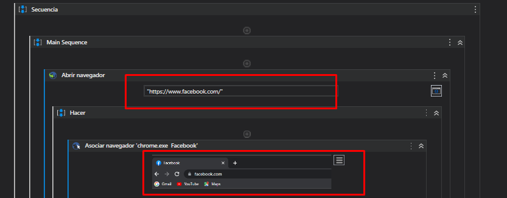

    - Seguir los pasos para compartir iniciar una transmisión en vivo en facebook, usando los elementos de _Click_ para cada opción.
    - Para ingresar el nombre de la transimisión se utiliza la una variable con el nombre "tituloLive" el cual tiene por nombre _UiPath201531166_.
    - Después se realizan agregan los pasos para realizar el proceso de consulta a las paginas repecticas.
    - Por último se finaliza la transimison con el elemento _Click_ en la opcion correspondiente en facebook.

2. Leer Datos de Excel
   Con el componente _Leer libro de fila_ se leen los datos siguientes:  _DPI_ y _fecha de nacimiento_ esto para poder realizar las consultas correspondientes, dichos datos se guarda en una variable de tipo objeto.

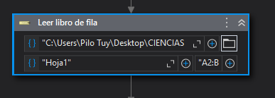

3. Consultar centro de votación
   Luego de tener los datos correspondientes, se procede a consultar el centro de votación con el elemento de navegador y siguiendo los pasos correspondientes para llegar a la consulta.
   - [TSE1] - Donde votas 2023!
  
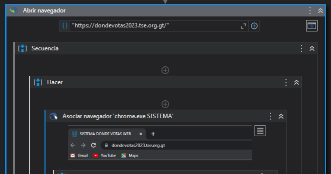
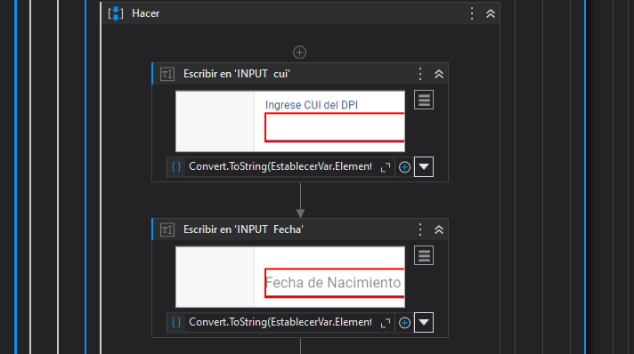
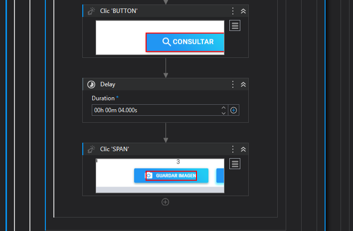

4. Consultar Empadronamiento
   Luego de tener los datos correspondientes, se procede a consultar la información del empadronamiento con el elemento de navegador y siguiendo los pasos correspondientes para llegar a la consulta.
   - [TSE2] -Consulta de Empadronamiento 2023!
  
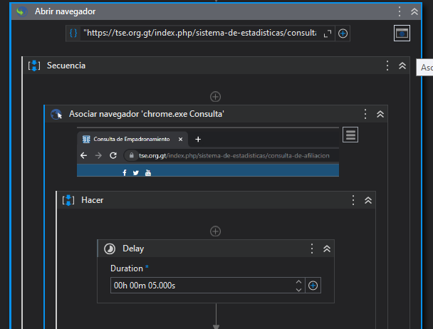
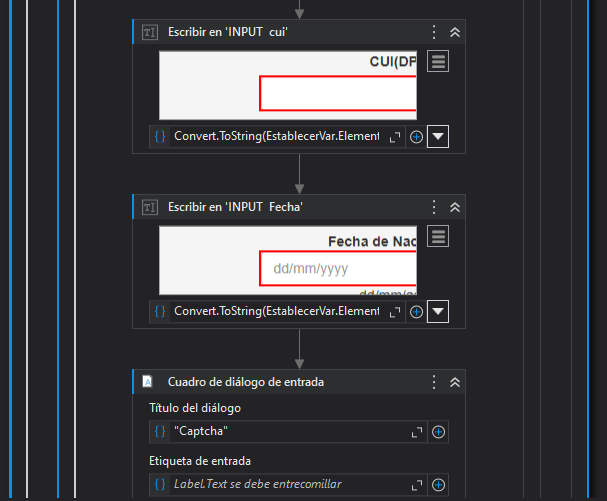
   
   - Para poder completar la consulta es necesario llenar un captcha, en este caso se utiliza el elemento _cuadro de dialogo de entrada_, que permite ingresar manualmente la palabra requerida, y este se guarda en la variable _Captcha_ para poder ingresar el valor guardado en el input correspondiente.
  
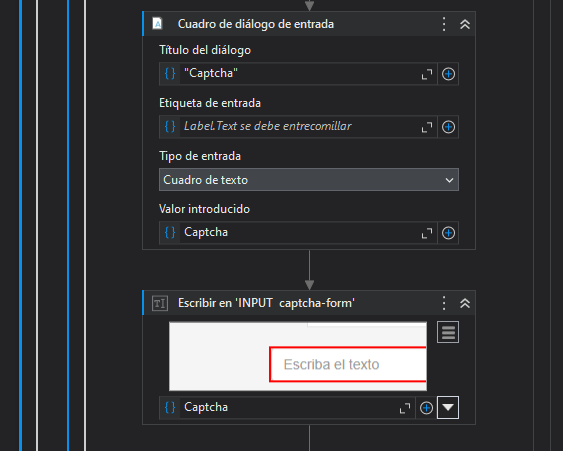

  - Se captura y se guarda la imagen con la información correspondiente, esto con los elementos de _Realizar captura de pantalla_ y _Guardar imagen_.
  
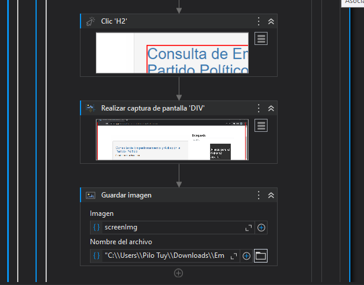

1. Enviar correo
   Con el elemento _Utilizar Gmail_ se puede realizar el envio de un correo electronico, para esto es necesario asociar el correo electronico registrado en UiPath. 
   Esta opción permite agregar un destinatario, Asunto, Cuerpo del correo, y adjuntar archivos. Para esta práctica se adjuntaron los archivos correspondientes a cada consulta. 

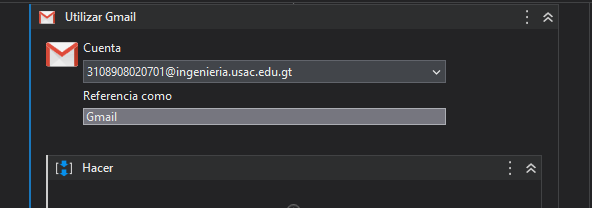
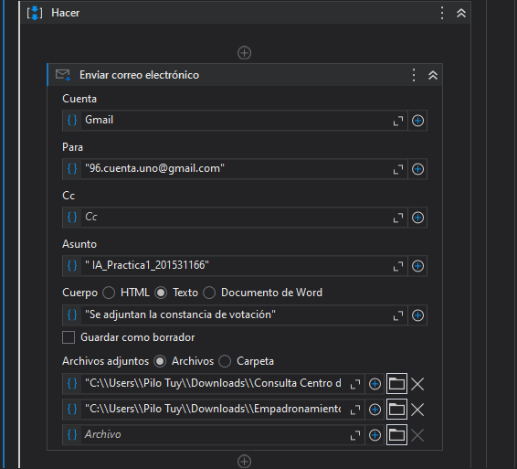

## _Perspectiva de la herramienta_
UiPath es una herramienta líder en procesos (RPA)  y gran  popularidad en el campo de la automatización. Tiene una plataforma completa y robusta que permite a las organizaciones automatizar tareas repetitivas y basadas en reglas, mejorando la eficiencia y reduciendo errores.

La ventaja de UiPath radica en su interfaz intuitiva y su capacidad para automatizar procesos complejos sin necesidad de programación avanzada. Utiliza una metodología de "arrastrar y soltar" que facilita la creación y la gestión de flujos de trabajo automatizados.

## _UiPath en lo Profesional_
- Con UiPath se puede automatizar tareas repetitivas y monótonas que consumen mucho tiempo en el ámbito laboral. 

- Con UiPath se puede facilitar  la integración de sistemas y aplicaciones en un entorno de trabajo, reduciendo así la necesidad de trabajo manual y minimizando errores.

- Con  UiPath es posible realizar el proceso  de extracción y procesamiento de datos, permitiendo  extraer información relevante de documentos, formularios o bases de datos, y utilizarla en otros procesos.

## _UiPath en la vida cotidiana_
- Con UiPath se pude  automatizar tareas domésticas, como la organización y clasificación de archivos en la computadora, la descarga y organización de archivos adjuntos de correo electrónico,entre otros.

- Con  UiPath se puede realizar busquedas y organizar información específica en sitios web,  búsquedas de productos y comparación de precios, complete formularios en línea de manera automática, o descargar y organizar archivos desde la web.

- Se puede aprovechar UiPath para crear un asistente virtual personalizado que realice diversas tareas; organizar el calendario, enviar recordatorios, buscar información en Internet, etc.

## _Conclusiones_
- Los conocimientos sobre las herramientas y capacidades que ofrece UiPath es fundamental para aprovechar al máximo su potencial en la creación de RPA. 

- La implementación de RPA con UiPath implica la identificación y solución de problemas específicos en los procesos empresariales.Permitiendo abordar estos desafíos de manera innovadora y eficiente.

-  Al crear procesos automáticos que imitan el comportamiento humano, se puede observar la versatilidad y las ventajas de la automatización robótica de procesos. 

[TSE1]: <https://dondevotas2023.tse.org.gt>
[TSE2]: <https://tse.org.gt/index.php/sistema-de-estadisticas/consulta-de-afiliacion>
