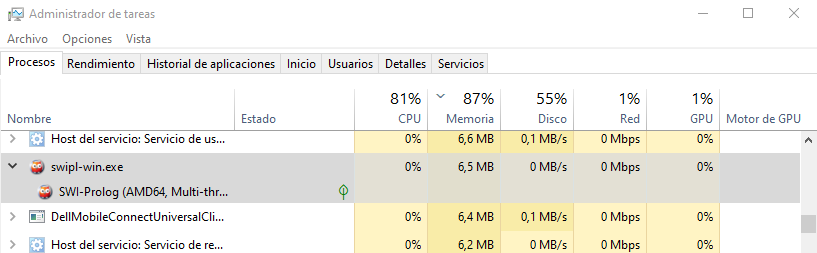
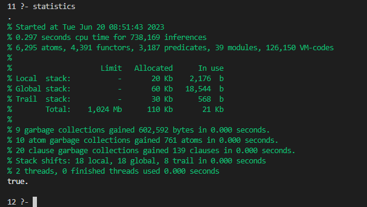
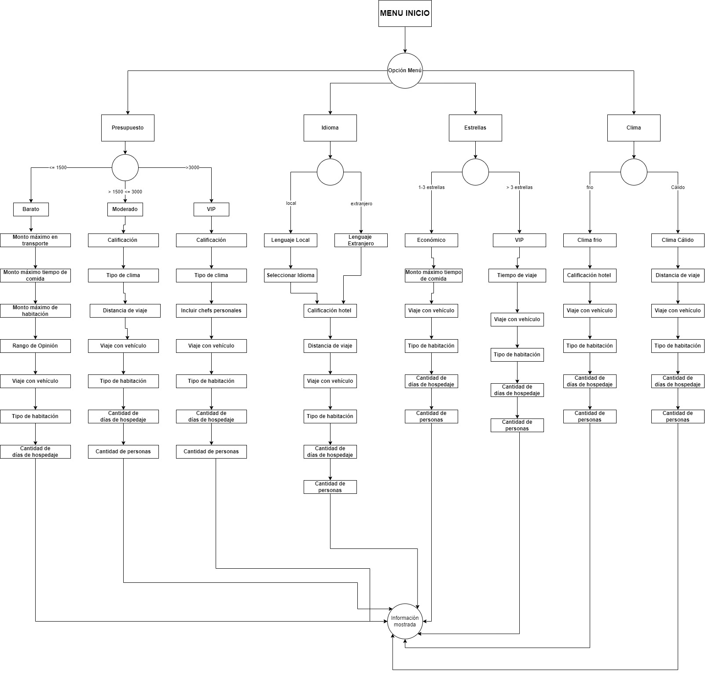

# Universidad de San Carlos de Guatemala
## Facultad de Ingeniería
## Escuela de Ciencias y Sistemas
## Inteligencia Artificial 1
## Junio 2023
### Ing. Luis Espino
### Aux. Ana Culajay
### Maynor Octavio Piló Tuy
### 201531166
---
<center> <h2> <i> Práctica 2 </i> </h2> </center>

---

## _Objetivos_

- Completar la comprensión de la programación lógica
- Aplicar los conocimientos adquiridos del uso del lenguaje Prolog
- Que el alumno pueda aplicar su ingenio en la realización de la solución del problema planteado
- Que el alumno pueda observar las ventajas de la realización de un sistema experto como paso fundamental a una inteligencia artificial funcional
- Comprender el uso y alimentación de la base de conocimientos para el uso del sistema experto
## _Detalle de la cantidad de recursos que utiliza el Sistema Experto en ejecución_
El programa Prolog consume un total de 6.5 MB de la memoria del ordenador.


Más detalles con el comando statistics.


## _Solución_

### Hechos
Los hechos utilizados en la práctica son los siguientes:

- hechos datos de clientes:

```
cliente(1,'Jose','Morales','Guatemala',27,'Soltero','Vacaciones').
cliente(2,'Fabrizio','Sartini','Italia',25,'Casado','Vacaciones').
cliente(3,'Gustavo','Molina','Holanda',15,'Soltero','Trabajo').
cliente(4,'Maria','Gutierrez','Guatemala',20,'Soltero','Vacaciones').
cliente(5,'Cornelio','Bustamante','Guatemala',18,'Soltero','Trabajo').
cliente(6,'Loraine','Cortez','Espanola',34,'Divorciado','Paso').
cliente(7,'Paco','Estanley','Guatemala',30,'Soltero','Vacaciones').
cliente(8,'Daniela','Samayoa','Guatemala',21,'Casado','Trabajo').
cliente(9,'Silvia','Santis','El Salvador',50,'Casado','Paso').
cliente(10,'Luis','Ortega','El Salvador',35,'Soltero','Vacaciones').
```

- hechos  de departamentos
```
departamento(1,'Peten',8,'espanol','tropical',600).
departamento(2,'Izabal',5,'espanol','calor',200).
departamento(3,'Alta Verapaz',6,'espanol','frio',300).
departamento(4,'Quiche',5,'katchikel','frio',400).
departamento(5,'Huehuetenango',7,'espanol','frio',500).
departamento(6,'Escuintla',2,'espanol','calor',50).
departamento(7,'San Marcos',3,'ingles','calor',400).
departamento(8,'Jutiapa',4,'katchikel','calor',100).
departamento(9,'Baja Verapaz',5,'ingles','templado',200).
departamento(10,'Santa Rosa',4,'ingles','calor',100).
```
- Hechos de hoteles
```
hotel(1, 'Camino Real', '14 calle zona 10', 4, 100.00, 200.00, 50.00, 14, 7).
hotel(2, 'Holiday Inn', 'puerto barrios 10ma calle', 4, 200.00, 350.00, 75.00, 2, 20).
hotel(3, 'Hu-nal ye', 'Los Amates 4ta av', 1, 50.00, 100.00, 60.00, 2, 260).
hotel(4, 'Onetwo', 'Santa Cruz 12 calle', 3, 200.00, 350.00, 80.00, 4, 288).
hotel(5, 'Paradise', 'Carcha 12-45', 2, 150.00, 250.00, 80.00, 3, 40).
hotel(6, 'Tikal', 'Santa Elena 54-85', 1, 200.00, 350.00, 100.00, 1, 350).
hotel(7, 'Atanacio', 'San Angel 5-8', 5, 350.00, 700.00, 100.00, 12, 102).
hotel(8, 'Pana Inn', 'Calzada Principal zona 3', 4, 250.00, 500.00, 50.00, 16, 80).
hotel(9, 'Tzul', 'San Agustin zona 1', 3, 150.00, 400.00, 50.00, 20, 156).
hotel(10, 'Ktuz', 'San Juan Tzul 8-24', 3, 300.00, 600.00, 50.00, 18, 150).
```
- Hechos de registro
```
registro(1, 10, 30, '10/01/2021', 4, 3).
registro(2, 10, 30, '8/04/2022', 2, 5).
registro(3, 10, 31, '2/07/2022', 5, 5).
registro(4, 11, 8, '4/06/2021', 6, 6).
registro(5, 11, 30, '23/02/2021', 2, 6).
registro(6, 12, 30, '30/01/2021', 5, 5).
registro(7, 12, 31, '14/02/2022', 6, 4).
registro(8, 13, 18, '5/10/2021', 3, 9).
registro(9, 13, 24, '20/09/2021', 1, 5).
registro(10, 14, 7, '13/01/2021', 4, 4).
```
### Menú Principal
Se tiene el siguiente menú para que el usuario pueda seleccionar el tipo de cotización para las opciones acorde a las opciones presentadas y tambien  la opción de reportes.

```pl
menuInicio :- 
    write('==============================================='), nl,
    write('|  Bienvenido al Sistema Experto en Hoteles   |'), nl,
    write('|---------------------------------------------|'), nl,
    write('|    1. Buscar por presupuesto                |'), nl,
    write('|    2. Buscar por idioma                     |'), nl,
    write('|    3. Buscar por cantidad de estrellas      |'), nl,
    write('|    4. Buscar por clima                      |'), nl,
    write('|    5. Reportes                              |'), nl,
    write('|    6. Salir                                 |'), nl,
    write('==============================================='), nl,
    read(OPCION), nl,
    opcionMenuInicio(OPCION),nl.
```
Donde
```
write: se utiliza para imprimir texto en consola
read: se utiliza para leer el valor ingresado en la consola
```

### Presupuesto
Se contempla tres opciones para un presupuesto que este acorde a las necesidades del usuario.
- Presupuesto Economico
- Presupuesto Medio
- Presupuesto VIP

### Presupuesto Económico
Se tiene las siguientes opciones:
```pl
presupuestoBarato(PRESUPUESTO) :-
( 
    write('========================== Plan económico ==========================  '), nl,
    write('Ingrese un monto máximo para el transporte: '), nl,
    read(TRANSPORTE_MAX), nl,
    write('Ingrese un monto máximo para la alimentación: '), nl,
    read(ALIMENTACION_MAX), nl,
    write('Ingrese un monto máximo para el hospedaje: '), nl,
    read(HOSPEDAJE_MAX), nl,
    write('Ingrese una opinion que dese para el hotel (1-10): '), nl,
    read(OPINION), nl,
    presupuestoBarato2(PRESUPUESTO, TRANSPORTE_MAX,ALIMENTACION_MAX,HOSPEDAJE_MAX,OPINION)
).

presupuestoBarato2(PRESUPUESTO, TRANSPORTE_MAX,ALIMENTACION_MAX,HOSPEDAJE_MAX,OPINION):-
(
    write(' ¿LLevara vehículo ?  (s/n):'), nl,
    read(VEHICULO), nl,
    write(' Tipo de habitación (escribir el número):
    1. Simple
    2. Doble'), nl,
    read(TIPO_HABITACION), nl,
    write('Cantidad de personas: '), nl,
    read(CANTIDAD_PERSONAS), nl,
    write('¿Cuantos dias desea hospedarse?:'), nl,
    read(DIAS), nl,
    resultadoBarato(PRESUPUESTO, TRANSPORTE_MAX,ALIMENTACION_MAX,HOSPEDAJE_MAX,OPINION,VEHICULO,TIPO_HABITACION,CANTIDAD_PERSONAS,DIAS)
).

resultadoBarato(PRESUPUESTO, TRANSPORTE_MAX,ALIMENTACION_MAX,HOSPEDAJE_MAX,OPINION,VEHICULO,TIPO_HABITACION,CANTIDAD_PERSONAS,DIAS):-
(
    % consultar HECHOS
    hotel(B_IDHOTEL,B_NOMBRE, B_DIRECCION,B_ESTRELLAS,B_HSIMPLE, B_HDOBLE, B_COMIDA,B_DEPTO, B_DISTANCIA),
    departamento(B_IDDEPTO, B_DEPTONOMBRE, B_TIEMPOVIAJE, B_IDIOMA, B_CLIMA, B_PASAJE),
    registro(_,_,B_IDHOTEL,_,_,B_OPINION),
    % realizar calculos
    (
        VEHICULO == 's' -> TRANSPORTE_COSTO is(B_DISTANCIA * 12.5 *2);  
        VEHICULO == 'n' -> TRANSPORTE_COSTO is(B_PASAJE * 2*CANTIDAD_PERSONAS) 
    ),
    (
        TIPO_HABITACION == 1 -> HABITACION_COSTO is (B_HSIMPLE * DIAS * CANTIDAD_PERSONAS);
        TIPO_HABITACION == 2 -> HABITACION_COSTO is (B_HDOBLE * DIAS * CANTIDAD_PERSONAS)
    ),
    ALIMENTACION_COSTO is (B_COMIDA * DIAS * CANTIDAD_PERSONAS),
    PRESUPUESTO_TOTAL is (TRANSPORTE_COSTO + HABITACION_COSTO + ALIMENTACION_COSTO),
    
    % restricciones
    PRESUPUESTO_TOTAL =< PRESUPUESTO,
    TRANSPORTE_COSTO =< TRANSPORTE_MAX,
    ALIMENTACION_COSTO =< ALIMENTACION_MAX,
    HABITACION_COSTO =< HOSPEDAJE_MAX,
    B_OPINION >= OPINION,
    % mostrar resultados
).
```

### Presupuesto Medio
Se tiene las siguientes opciones:
```pl
presupuestoMedio(PRESUPUESTO) :-
(
    write('========================== Plan medio ==========================  '), nl,
    write('Ingrese una calificación para el hotel (1-5): '), nl,
    read(CALIFICACION), nl,
    write('Ingrese el tipo de clima. (el número)
    1. Calor
    2. Frío
    3. Templado
    4. Tropical '), nl,
    read(CLIMA), nl,
    write('Ingrese la distancia maxima que desee recorrer hacia el hotel: '), nl,
    read(DISTANCIA_MAX), nl
    presupuestoMedio2(PRESUPUESTO, CALIFICACION, CLIMA, DISTANCIA_MAX)
).

presupuestoMedio2(PRESUPUESTO,CALIFICACION,CLIMA,DISTANCIA_MAX ):-
(
    write(' ¿LLevara vehículo ?  (s/n):'), nl,
    read(VEHICULO), nl,
    write(' Tipo de habitación (escribir el número):
    1. Simple
    2. Doble'), nl,
    read(TIPO_HABITACION), nl,
    write('Cantidad de personas: '), nl,
    read(CANTIDAD_PERSONAS), nl,
    write('¿Cuantos dias desea hospedarse?:'), nl,
    read(DIAS), nl,
    resultadoMedio(PRESUPUESTO,CALIFICACION,CLIMA,DISTANCIA_MAX,VEHICULO,TIPO_HABITACION,CANTIDAD_PERSONAS,DIAS)
    
 
).

resultadoMedio(PRESUPUESTO,CALIFICACION,CLIMA,DISTANCIA_MAX,VEHICULO,TIPO_HABITACION,CANTIDAD_PERSONAS,DIAS):-
(
    % consultar HECHOS
    hotel(M_IDHOTEL,M_NOMBRE, M_DIRECCION,M_ESTRELLAS,M_HSIMPLE, M_HDOBLE, M_COMIDA,M_DEPTO, M_DISTANCIA),
    departamento(M_IDDEPTO, M_DEPTONOMBRE, M_TIEMPOVIAJE, M_IDIOMA, M_CLIMA, M_PASAJE),
    registro(_,_,M_IDHOTEL,_,_,M_OPINION),
    % realizar calculos
    (
        VEHICULO == 's' -> TRANSPORTE_COSTO is(M_DISTANCIA * 12.5 *2);  
        VEHICULO == 'n' -> TRANSPORTE_COSTO is(M_PASAJE * 2*CANTIDAD_PERSONAS) 
    ),
    (
        TIPO_HABITACION == 1 -> HABITACION_COSTO is (M_HSIMPLE * DIAS * CANTIDAD_PERSONAS);
        TIPO_HABITACION == 2 -> HABITACION_COSTO is (M_HDOBLE * DIAS * CANTIDAD_PERSONAS)
    ),
    ALIMENTACION_COSTO is (M_COMIDA * DIAS * CANTIDAD_PERSONAS),
    PRESUPUESTO_TOTAL is (TRANSPORTE_COSTO + HABITACION_COSTO + ALIMENTACION_COSTO),
    % restricciones
    PRESUPUESTO_TOTAL =< PRESUPUESTO,
    CALIFICACION =< M_OPINION,
    CLIMA == 1 -> M_CLIMA == 'calor',
    CLIMA == 2 -> M_CLIMA == 'frio',
    CLIMA == 3 -> M_CLIMA == 'templado',
    CLIMA == 4 -> M_CLIMA == 'tropical',
    DISTANCIA_MAX =< M_DISTANCIA,

    % mostrar resultados
    write('========================== Resultados ==========================  '), nl,
    write('Hotel: '), write(M_NOMBRE), nl,
    write('Departamento: '), write(M_DEPTONOMBRE), nl,
    write('Dirección: '), write(M_DIRECCION), nl,
    write('Costo de transporte: '), write(TRANSPORTE_COSTO), nl,
    write('Costo de hospedaje: '), write(HABITACION_COSTO), nl,
    write('Costo de alimentación: '), write(ALIMENTACION_COSTO), nl,
    write('Costo total: '), write(PRESUPUESTO_TOTAL), nl,
    write('================================================================  '), nl
).

```
### Presupuesto VIP
Se tiene las siguientes opciones:
```pl
presupuestoCaro(PRESUPUESTO) :-
(
    write('========================== Plan VIP ==========================  '), nl,
    write('Ingrese una calificación para el hotel (1-5): '), nl,
    read(CALIFICACION), nl,
    write('Ingrese el tipo de clima.
    1. Calor
    2. Frío
    3. Templado
    4. Tropical '), nl,
    read(CLIMA), nl,
    write('¿ Desea incluir un chef ?  (s/n) '), nl,
    read(CHEF), nl,
    presupuestoCaro2(PRESUPUESTO, CALIFICACION, CLIMA, CHEF)
).

presupuestoCaro2(PRESUPUESTO,CALIFICACION,CLIMA,CHEF ):-
(
    write(' ¿LLevara vehículo ?  (s/n):'), nl,
    read(VEHICULO), nl,
    write(' Tipo de habitación (escribir el número):
    1. Simple
    2. Doble'), nl,
    read(TIPO_HABITACION), nl,
    write('Cantidad de personas: '), nl,
    read(CANTIDAD_PERSONAS), nl,
    write('¿Cuantos dias desea hospedarse?:'), nl,
    read(DIAS), nl,
    resultadoCaro(PRESUPUESTO,CALIFICACION,CLIMA,CHEF,VEHICULO,TIPO_HABITACION,CANTIDAD_PERSONAS,DIAS)
).

resultadoCaro(PRESUPUESTO,CALIFICACION,CLIMA,CHEF,VEHICULO,TIPO_HABITACION,CANTIDAD_PERSONAS,DIAS):-
(
    % consultar HECHOS
    hotel(M_IDHOTEL,M_NOMBRE, M_DIRECCION,M_ESTRELLAS,M_HSIMPLE, M_HDOBLE, M_COMIDA,M_DEPTO, M_DISTANCIA),
    departamento(M_IDDEPTO, M_DEPTONOMBRE, M_TIEMPOVIAJE, M_IDIOMA, M_CLIMA, M_PASAJE),
    trabajador(_,_, M_CARGO,M_IDHOTEL),
    %realizar calculos
    (
        VEHICULO == 's' -> TRANSPORTE_COSTO is(M_DISTANCIA * 12.5 *2);  
        VEHICULO == 'n' -> TRANSPORTE_COSTO is(M_PASAJE * 2*CANTIDAD_PERSONAS) 
    ),
    (
        TIPO_HABITACION == 1 -> HABITACION_COSTO is (M_HSIMPLE * DIAS * CANTIDAD_PERSONAS);
        TIPO_HABITACION == 2 -> HABITACION_COSTO is (M_HDOBLE * DIAS * CANTIDAD_PERSONAS)
    ),
    ALIMENTACION_COSTO is (M_COMIDA * DIAS * CANTIDAD_PERSONAS),
    PRESUPUESTO_TOTAL is (TRANSPORTE_COSTO + HABITACION_COSTO + ALIMENTACION_COSTO),
    % restricciones
    PRESUPUESTO_TOTAL =< PRESUPUESTO,
    CALIFICACION =< M_OPINION,
    CLIMA == 1 -> M_CLIMA == 'calor',
    CLIMA == 2 -> M_CLIMA == 'frio',
    CLIMA == 3 -> M_CLIMA == 'templado',
    CLIMA == 4 -> M_CLIMA == 'tropical',
    CHEF == 's' -> M_CARGO == 'Chef',
    % mostrar resultados
    write('========================== Resultados ==========================  '), nl,
    write('Hotel: '), write(M_NOMBRE), nl,
    write('Departamento: '), write(M_DEPTONOMBRE), nl,
    write('Dirección: '), write(M_DIRECCION), nl,
    write('Costo de transporte: '), write(TRANSPORTE_COSTO), nl,
    write('Costo de hospedaje: '), write(HABITACION_COSTO), nl,
    write('Costo de alimentación: '), write(ALIMENTACION_COSTO), nl,
    write('Costo total: '), write(PRESUPUESTO_TOTAL), nl,
    write('================================================================  '), nl
).
```

### Idioma
Se contempla dos opciones para un el idioma del hotel segun las necesidades del usuario.
- Presupuesto Local
  - Español
  - Kaqchikel
  - Kiche
- Ingles

### Menú Idioma
Se tiene la opcion de un idioma extranjero o no.
```pl
menuIdioma :- 
(   
    write('=============================================='), nl,
    write('|        ¿ Desea un idioma extranjero ?      |'), nl,
    write('|                    s/n                     |'), nl,
    write('|--------------------------------------------|'), nl,
    write('Ingrese su respuesta: '), nl,
    read(R_IDIOMA), nl,    
    opcionesIdioma(R_IDIOMA)
).
```
Opciones para el idioma.
```pl
idiomaLocal():-
(
    write('=============================================='), nl,
    write('|        ¿ Seleccione un idioma local ?      |'), nl,
    write('|    1. Espanol                              |'), nl,
    write('|    2. katchikel                            |'), nl,
    write('|    3. Ketchi                               |'), nl,
    write('Ingrese su respuesta: '), nl,
    read(R_IDIOMA_LOCAL), nl,
    opcionesIdiomaLocal(R_IDIOMA_LOCAL)
).

opcionesIdiomaLocal(R_IDIOMA_LOCAL) :-
(
    write('Ingrese una calificación minima para el hotel (1-5): '), nl,
    read(CALIFICACION), nl,
    write('Ingrese la distancia maxima que desee recorrer hacia el hotel: '), nl,
    read(DISTANCIA_MAX), nl
    write(' ¿LLevara vehículo ?  (s/n):'), nl,
    read(VEHICULO), nl,
    write(' Tipo de habitación (escribir el número):
    1. Simple
    2. Doble'), nl,
    read(TIPO_HABITACION), nl,
    write('Cantidad de personas: '), nl,
    read(CANTIDAD_PERSONAS), nl,
    write('¿Cuantos dias desea hospedarse?:'), nl,
    read(DIAS), nl,
    resultadoIdiomaLocal(R_IDIOMA_LOCAL,CALIFICACION,DISTANCIA_MAX,VEHICULO,TIPO_HABITACION,CANTIDAD_PERSONAS,DIAS)
).

resultadoIdiomaLocal(R_IDIOMA_LOCAL,CALIFICACION,DISTANCIA_MAX,VEHICULO,TIPO_HABITACION,CANTIDAD_PERSONAS,DIAS)
(
    % consultar HECHOS
    hotel(M_IDHOTEL,M_NOMBRE, M_DIRECCION,_,M_HSIMPLE, M_HDOBLE, M_COMIDA,M_DEPTO, M_DISTANCIA),
    departamento(M_IDDEPTO, M_DEPTONOMBRE, M_TIEMPOVIAJE, M_IDIOMA, M_CLIMA, M_PASAJE),
    registro(_,_,M_IDHOTEL,_,_,OPINION),
    % realizar calculos
    (
        VEHICULO == 's' -> TRANSPORTE_COSTO is(M_DISTANCIA * 12.5 *2);  
        VEHICULO == 'n' -> TRANSPORTE_COSTO is(M_PASAJE * 2*CANTIDAD_PERSONAS) 
    ),
    (
        TIPO_HABITACION == 1 -> HABITACION_COSTO is (M_HSIMPLE * DIAS * CANTIDAD_PERSONAS);
        TIPO_HABITACION == 2 -> HABITACION_COSTO is (M_HDOBLE * DIAS * CANTIDAD_PERSONAS)
    ),
    ALIMENTACION_COSTO is (M_COMIDA * DIAS * CANTIDAD_PERSONAS),
    PRESUPUESTO_TOTAL is (TRANSPORTE_COSTO + HABITACION_COSTO + ALIMENTACION_COSTO),
    % restricciones
    M_IDIOMA == R_IDIOMA_LOCAL,
    M_DISTANCIA =< DISTANCIA_MAX,
    CALIFICACION >= OPINION,
    % mostrar resultados
    write('========================== Resultados ==========================  '), nl,
    write('Hotel: '), write(M_NOMBRE), nl,
    write('Departamento: '), write(M_DEPTONOMBRE), nl,
    write('Dirección: '), write(M_DIRECCION), nl,
    write('Costo de transporte: '), write(TRANSPORTE_COSTO), nl,
    write('Costo de hospedaje: '), write(HABITACION_COSTO), nl,
    write('Costo de alimentación: '), write(ALIMENTACION_COSTO), nl,
    write('Costo total: '), write(PRESUPUESTO_TOTAL), nl,
    write('================================================================  '), nl
).
```


### Estrellas
Se contempla dos opciones para las estrellas reconocidas para cada hotel.
- Hoteles menores a 3 estrellas
- Hoteles mayores a 3 estrellas

### Menú Estrellas
Se tiene la opcion de ingresar la cantidad de estrellas.
```pl
menuEstrellas():-
(
    write('==============================================================='), nl,
    write('|                      CANTIDAD DE ESTRELLAS                   |'), nl,
    write('==============================================================='), nl,
    write(' Ingrese una calificación de estrellas minima para el hotel (1-5): '), nl,
    read(CALIFICACION), nl,
    CALIFICACION < 4 -> hotelEconomico(CALIFICACION);
    CALIFICACION >= 4 -> hotelCaro(CALIFICACION)
).
```
Dependiendo de la cantidad ingresada se tendra el flujo siguiente.
```pl
hotelEconomico(CALIFICACION):-
(
    write('Ingrese un monto máximo para la alimentación: '), nl,
    read(ALIMENTACION_MAX), nl,
    write(' ¿LLevara vehículo ?  (s/n):'), nl,
    read(VEHICULO), nl,
    write(' Tipo de habitación (escribir el número):
    1. Simple
    2. Doble'), nl,
    read(TIPO_HABITACION), nl,
    write('Cantidad de personas: '), nl,
    read(CANTIDAD_PERSONAS), nl,
    write('¿Cuantos dias desea hospedarse?:'), nl,
    read(DIAS), nl,
    resultadohotelEconomico(CALIFICACION,ALIMENTACION_MAX,VEHICULO,TIPO_HABITACION,CANTIDAD_PERSONAS,DIAS)
).

resultadohotelEconomico(CALIFICACION,ALIMENTACION_MAX,VEHICULO,TIPO_HABITACION,CANTIDAD_PERSONAS,DIAS):-
(
    % consultar HECHOS
    hotel(M_IDHOTEL,M_NOMBRE, M_DIRECCION,M_ESTRELLAS,M_HSIMPLE, M_HDOBLE, M_COMIDA,M_DEPTO, M_DISTANCIA),
    departamento(M_IDDEPTO, M_DEPTONOMBRE, M_TIEMPOVIAJE, _, _, M_PASAJE),
    % realizar calculos
    (
        VEHICULO == 's' -> TRANSPORTE_COSTO is(M_DISTANCIA * 12.5 *2);  
        VEHICULO == 'n' -> TRANSPORTE_COSTO is(M_PASAJE * 2*CANTIDAD_PERSONAS) 
    ),
    (
        TIPO_HABITACION == 1 -> HABITACION_COSTO is (M_HSIMPLE * DIAS * CANTIDAD_PERSONAS);
        TIPO_HABITACION == 2 -> HABITACION_COSTO is (M_HDOBLE * DIAS * CANTIDAD_PERSONAS)
    ),
    ALIMENTACION_COSTO is (M_COMIDA * DIAS * CANTIDAD_PERSONAS),
    PRESUPUESTO_TOTAL is (TRANSPORTE_COSTO + HABITACION_COSTO + ALIMENTACION_COSTO),
    % restricciones
    M_ESTRELLAS =< 3,
    ALIMENTACION_COSTO =< ALIMENTACION_MAX,
    % mostrar resultados
    imprimirPresupuesto(M_NOMBRE,M_DEPTONOMBRE,M_DIRECCION,TRANSPORTE_COSTO,HABITACION_COSTO,ALIMENTACION_COSTO,PRESUPUESTO_TOTAL)


).
```

### Clima
Se contempla dos opciones para hoteles que se ubican en regiones con los siguietes climas.

- Frío
   - Frío
   - Templado
- Calído
   - Calor
   - Tropical
  
### Menú Clima
Se tienen las siguientes opciones para el menu del clima
```pl
menuEstrellas():-
(
    write('==============================================================='), nl,
    write('|                            CLIMA                            |'), nl,
    write('==============================================================='), nl,
    write(' Ingrese un tipo de clima: '), nl,
    write(' 1. Frío'), nl,
    write(' 2. Calido'), nl,
    read(CLIMA), nl,
    CLIMA == 1 -> hotelFrio();
    CLIMA == 2 -> hotelCalido()

).
```
Acorde a las necesidades del usuario, se mostraran una serie de preguntas para llegar a los resultados. 
```pl
hotelFrio():-
(
    write('Ingrese una calificación máxima para el viaje: '), nl,
    read(OPINION_MAX), nl,
    write(' ¿LLevara vehículo ?  (s/n):'), nl,
    read(VEHICULO), nl,
    write(' Tipo de habitación (escribir el número):
    1. Simple
    2. Doble'), nl,
    read(TIPO_HABITACION), nl,
    write('Cantidad de personas: '), nl,
    read(CANTIDAD_PERSONAS), nl,
    write('¿Cuantos dias desea hospedarse?:'), nl,
    read(DIAS), nl,
    resultadoHotelFrio(OPINION_MAX,VEHICULO,TIPO_HABITACION,CANTIDAD_PERSONAS,DIAS)
).

resultadoHotelFrio(OPINION_MAX,VEHICULO,TIPO_HABITACION,CANTIDAD_PERSONAS,DIAS):-
(
    % consultar HECHOS
    hotel(M_IDHOTEL,M_NOMBRE, M_DIRECCION,M_ESTRELLAS,M_HSIMPLE, M_HDOBLE, M_COMIDA,M_DEPTO, M_DISTANCIA),
    departamento(M_IDDEPTO, M_DEPTONOMBRE, M_TIEMPOVIAJE, M_CLIMA, _, M_PASAJE),
    registro(_,_,M_IDHOTEL,_,_,OPINION),

    % realizar calculos
    (
        VEHICULO == 's' -> TRANSPORTE_COSTO is(M_DISTANCIA * 12.5 *2);  
        VEHICULO == 'n' -> TRANSPORTE_COSTO is(M_PASAJE * 2*CANTIDAD_PERSONAS) 
    ),
    (
        TIPO_HABITACION == 1 -> HABITACION_COSTO is (M_HSIMPLE * DIAS * CANTIDAD_PERSONAS);
        TIPO_HABITACION == 2 -> HABITACION_COSTO is (M_HDOBLE * DIAS * CANTIDAD_PERSONAS)
    ),
    ALIMENTACION_COSTO is (M_COMIDA * DIAS * CANTIDAD_PERSONAS),
    PRESUPUESTO_TOTAL is (TRANSPORTE_COSTO + HABITACION_COSTO + ALIMENTACION_COSTO),
    % restricciones
    (M_CLIMA == 'frio'; M_CLIMA == 'templado'),
    OPINION =< OPINION_MAX,
    % mostrar resultados
    imprimirPresupuesto(M_NOMBRE,M_DEPTONOMBRE,M_DIRECCION,TRANSPORTE_COSTO,HABITACION_COSTO,ALIMENTACION_COSTO,PRESUPUESTO_TOTAL)
).
```

### Resultados
Para mostrar los resultados se tiene el siguiente código, este código aplica para cada una de las opciones mostradas anteriormente.
```pl
imprimirPresupuesto(NOMBRE,DEPARTAMENTO,DIRECCION,TRANSPORTE_COSTO,HABITACION_COSTO,ALIMENTACION_COSTO,PRESUPUESTO_TOTAL):-
(
    format(
    '========================= Resultados =========================
    Hotel:                  ~a
    Departamento:           ~a
    Dirección:              ~a
    Costo de transporte:    ~a
    Costo de hospedaje:     ~a
    Costo de alimentación:  ~a
    Costo total:            ~a
    ================================================================', 
    [NOMBRE,DEPARTAMENTO,DIRECCION,TRANSPORTE_COSTO,HABITACION_COSTO,ALIMENTACION_COSTO,PRESUPUESTO_TOTAL]),nl,fail
).
```

## Reportes
Para la parte de reportes se tiene las siguientes opciones que se van mostrando en un menú:
```pl
menuReportes() :-
    % limpiar pantalla
    write('\e[H\e[2J'),
    write('========================================================================='), nl,
    write('|                          SECCIÓN DE REPORTES                           |'), nl,
    write('|------------------------------------------------------------------------|'), nl,
    write('|   1. Nombre y nacionalidad de clientes nacidos en Europa con opiniones |'), nl,
    write('|      mayores de 5                                                      |'), nl,
    write('|                                                                        |'), nl,
    write('|   2. Nombre y estado civil de clientes con reservaciones en hoteles con|'), nl,
    write('|      más de 4 estrellas                                                |'), nl,
    write('|                                                                        |'), nl,
    write('|   3. Nombre de Administradores en  hoteles con valoraciones mayor o    |'), nl,
    write('|      igual que 5                                                       |'), nl,
    write('|                                                                        |'), nl,
    write('|   4. Departamentos y hotel con más reservaciones, en clima calor       |'), nl,
    write('|      reservaciones, en clima calor                                     |'), nl,
    write('|                                                                        |'), nl,
    write('|   5. Nombre de clientes extranjeros hospedados en departamentos de     |'), nl,
    write('|      habla español                                                     |'), nl,
    write('|                                                                        |'), nl,
    write('|   6. Nombre de Hotel, departamento,idioma y Nombre de clientes con     |'), nl,
    write('|      opiniones mayores o igual que 7  y estadías mayores o igual a 3   |'), nl,
    write('|      días                                                              |'), nl,
    write('|                                                                        |'), nl,
    write('|   7. Nombre País y Nombre de Hotel de  clientes extranjeros hospedados |'), nl,
    write('|      en departamentos de habla inglés,con menos de 2 días de hospedaje |'), nl,
    write('|                                                                        |'), nl,
    write('|   8. País que reservó en Petén                                         |'), nl,
    write('|                                                                        |'), nl,
    write('|   9. Nombre de Hotel y dirección de hoteles que recibieron a clientes  |'), nl,
    write('|      casados, que tengan opiniones mayores de 6 por personas con       |'), nl,
    write('|      mínimo de 3 días de estadía                                       |'), nl,
    write('=========================================================================='), nl,
    write('Seleccione una opción: '), nl,
    read(OPCION), nl,
    opcionMenuReportes(OPCION),nl.
```
Cada uno de los reportes tiene la siguiente estructura, o estructura similar

### Reporte 1
```pl
reporte1() :- 
    write('==================================================================='), nl,
    write('|     Reporte 1: Clientes en Europa  con opiniones mayores de 5   |'), nl,
    write('==================================================================='), nl,
    cliente(IDCLIENTE, CLINOMBRE, CLIAPELLIDO, CLIPAIS, _, _, _),
    registro(_,IDCLIENTE, _, _,_, REGOPINION),
    REGOPINION > 5,
    (CLIPAIS == 'Italia' ; CLIPAIS == 'Holanda'; CLIPAIS == 'Espanola'; CLIPAIS == 'Espana'; CLIPAIS == 'Inglaterra'),
    imprimirReporte1(CLINOMBRE, CLIAPELLIDO, CLIPAIS).
   

imprimirReporte1(CLINOMBRE, CLIAPELLIDO, CLIPAIS) :-
    write('-------------------------------------------------------------------'), nl,
    format('~w ~w   | ~w', [CLINOMBRE, CLIAPELLIDO, CLIPAIS]),nl,fail,true.
```
### Reporte 2
```pl
reporte2():-
    write('================================================================================='), nl,
    write('|     Reporte 2: Clientes con reservaciones en hoteles con más de 4 estrellas   |'), nl,
    write('================================================================================='), nl,
    cliente(IDCLIENTE, CLINOMBRE, CLIAPELLIDO, _, _,CLIESTADO, _),
    registro(_,IDCLIENTE, IDHOTEL, _,_, _),
    hotel(IDHOTEL,_, _, HOTESTRELLAS, _,_,_,_,_),
    HOTESTRELLAS > 4,
    imprimirReporte2(CLINOMBRE, CLIAPELLIDO, CLIESTADO).

imprimirReporte2(CLINOMBRE, CLIAPELLIDO, CLIESTADO) :-
    write('---------------------------------------------------------------------------------'), nl,
    format('~w ~w   | ~w', [CLINOMBRE, CLIAPELLIDO, CLIESTADO]),nl,fail,true.
```

### Reporte 3
```pl
reporte3():-
    write('==========================================================================='), nl,
    write('|     Reporte 3: Administradores en  hoteles con valoraciones mayor o    |'), nl,
    write('|      igual que 5                                                       |'), nl,
    write('==========================================================================='), nl,
    trabajador(_, ADMNOMBRE, CARGO, IDHOTEL),
    CARGO == 'Administrador',
    registro(_,_, IDHOTEL, _,_,CALIFICACION),
    % hotel(IDHOTEL, _, _, CALIFICACION, _, _, _, _, _),
    CALIFICACION >= 5,
    imprimirReporte3(ADMNOMBRE).

imprimirReporte3(ADMNOMBRE) :-
    write('---------------------------------------------------------------------------'), nl,
    format('~w', [ADMNOMBRE]),nl,fail,true.
```

### Reporte 4
```pl
reporte4():-
    write('=============================================================================='), nl,
    write('|     Reporte 4: Departamentos y hotel con más reservaciones, en clima calor |'), nl,
    write('=============================================================================='), nl,
    departamento(IDDEPARTAMENTO, NOMBREDPTO,_,_,CLIMADPTO,_),
    CLIMADPTO == 'calor',
    registro(_,_,IDDEPTO, _,_,_),
    hotel(IDHOTEL, HOTNOMBRE, _, _, _, _, _, IDDEPARTAMENTO, _) ,
    imprimirReporte4(NOMBREDPTO, HOTNOMBRE).

imprimirReporte4(NOMBREDPTO, HOTNOMBRE) :-
    write('------------------------------------------------------------------------------'), nl,
    format('~w   | ~w', [NOMBREDPTO, HOTNOMBRE]),nl,fail,true.  
```

### Reporte 5
```pl
reporte5():-
    write('=============================================================================='), nl,
    write('|     Reporte 5: Nombre de clientes extranjeros hospedados en departamentos |'), nl,
    write('|      de habla espanol                                                     |'), nl,
    write('=============================================================================='), nl,
    cliente(IDCLIENTE, CLINOMBRE, CLIAPELLIDO, CLIPAIS, _, _, _),
    hotel(IDHOTEL, _, _, _, _, _, _, IDDEPARTAMENTO, _),
    registro(_,IDCLIENTE, IDHOTEL, _,_,_),
    departamento(IDDEPARTAMENTO, _,_, IDIOMA, _, _),
    (IDIOMA == 'espanol'; IDIOMA == 'Espanola'),
    CLIPAIS \== 'Guatemala',
    imprimirReporte5(CLINOMBRE, CLIAPELLIDO, CLIPAIS).

imprimirReporte5(CLINOMBRE, CLIAPELLIDO, CLIPAIS) :-
    write('------------------------------------------------------------------------------'), nl,
    format('~w ~w   | ~w', [CLINOMBRE, CLIAPELLIDO, CLIPAIS]),nl,fail,true.
```

### Reporte 6
```pl
reporte6():-
    write('=============================================================================='), nl,
    write('|     Reporte 6: Nombre de Hotel, departamento, idioma y Nombre de clientes  |'), nl,
    write('|     con opiniones mayores o igual que 7 y estadías mayores o igual a 3 días|'), nl, 
    write('=============================================================================='), nl,
    hotel(IDHOTEL, HOTNOMBRE, _, _, _, _, _, IDDEPARTAMENTO, _),  
    departamento(IDDEPARTAMENTO, NOMBREDPTO,_, IDIOMA, _, _),  
    cliente(IDCLIENTE, CLINOMBRE, CLIAPELLIDO, _, _, _, _),
    registro(_,IDCLIENTE, IDHOTEL, _,REGESTADIA, REGOPINION),    
    REGESTADIA >= 3,
    REGOPINION >= 7,
    imprimirReporte6(HOTNOMBRE, NOMBREDPTO, IDIOMA, CLINOMBRE, CLIAPELLIDO).

imprimirReporte6(HOTNOMBRE, NOMBREDPTO, IDIOMA, CLINOMBRE, CLIAPELLIDO) :-   
    write('------------------------------------------------------------------------------'), nl,
    format('~w   | ~w   | ~w   | ~w ~w', [HOTNOMBRE, NOMBREDPTO, IDIOMA, CLINOMBRE, CLIAPELLIDO]),nl,fail,true.                                    
```

### Reporte 7
```pl
reporte7():-
    write('=================================================================================='), nl,
    write('| Reporte 7: Nombre País y Nombre de Hotel de clientes extranjeros hospedados en |'), nl,
    write('| departamentos de habla inglés, con menos de 2 días de hospedaje                |'), nl, 
    write('=================================================================================='), nl,
    hotel(IDHOTEL, HOTNOMBRE, _, _, _, _, _, IDDEPARTAMENTO, _),  
    departamento(IDDEPARTAMENTO,_,_, IDIOMA, _, _),  
    cliente(IDCLIENTE,_, _,NACIONALIDAD, _,_,_),
    registro(_,IDCLIENTE, IDHOTEL, _,REGESTADIA, _),    
    IDIOMA == 'ingles',
    NACIONALIDAD \== 'Guatemala',
    REGESTADIA < 2,
    imprimirReporte7(NACIONALIDAD,HOTNOMBRE).

imprimirReporte7(NACIONALIDAD,HOTNOMBRE) :-
    write('----------------------------------------------------------------------------------'), nl,
    format('~w   | ~w', [NACIONALIDAD,HOTNOMBRE]),nl,fail,true.
```

### Reporte 8
```pl
reporte8():-
    write('=============================================='), nl,
    write('|     Reporte 8: País que reservo en Peten   |'), nl,
    write('=============================================='), nl,
    cliente(IDCLIENTE,_, _,NACIONALIDAD, _,_,_),
    registro(_,IDCLIENTE, IDHOTEL, _,_,_),
    hotel(IDHOTEL, _, _, _, _, _, _, IDDEPARTAMENTO, _),
    departamento(IDDEPARTAMENTO, NOMBREDPTO,_, _, _, _),
    NOMBREDPTO == 'Peten',
    imprimirReporte8(NACIONALIDAD).

imprimirReporte8(NACIONALIDAD) :-
    write('------------------------------------------------'), nl,
    format('~w', [NACIONALIDAD]),nl,fail,true.
```

### Reporte 9
```pl
reporte9():-
    write('==========================================================================================='), nl,
    write('|     Reporte 9: Nombre de Hotel y dirección de hoteles que recibieron a clientes casados |'), nl,
    write('|     que tengan opiniones mayores de 6 por personas con mínimo de 3 días de estadía      |'), nl,
    write('==========================================================================================='), nl,
    cliente(IDCLIENTE,_, _,_, _,ESTADOCIVIL,_),
    registro(_,IDCLIENTE, IDHOTEL, _,REGESTADIA, REGOPINION),
    hotel(IDHOTEL, HOTNOMBRE, HOTDIRECCION, _, _, _, _, _, _),
    ESTADOCIVIL == 'Casado',
    REGESTADIA >= 3,
    REGOPINION >= 6,
    imprimirReporte9(HOTNOMBRE, HOTDIRECCION).

imprimirReporte9(HOTNOMBRE, HOTDIRECCION) :-
    write('-------------------------------------------------------------------------------------------'), nl,
    format('~w   | ~w', [HOTNOMBRE, HOTDIRECCION]),nl,fail,true.
```

## _Conclusiones_
- La comprensión de la programación lógica es fundamental para desarrollar habilidades en el ámbito de la resolución de problemas y la lógica computacional. 

- Los conocimientos adquiridos en el uso del lenguaje Prolog permite  desarrollar habilidades prácticas en la programación lógica. Al utilizar Prolog, se pueden crear programas eficientes y expresivos.

- La comprensión del uso de la base de conocimientos en el sistema experto es esencial para aprovechar al máximo su potencial. Al entender cómo se estructuran y utilizan los conocimientos en el sistema experto, desarrollando soluciones basadas en conocimientos expertos.

## _Diagrama de Encadenamiento_


### _Explicación:_

#### Opciones
Se tienen cuatro caminos (opciones)
- Presupuesto
- Idioma
- Cantidad de estrellas 
- Clima

#### Presupuesto
Según el presupuesto, este se pueden tener las opciones de:
- Económico que es menoer a 1500
- Moderado que esta entre 1500 y 3000
- VIP  esta por encima de 3000

#### Idioma
Se tienen  2 opciones que son 
- Lenguaje Local
   - Español
   - Kaqchikel
- Lenguaje Extranjero
   - Ingles

### Cantidad de Estrellas

Se tienen dos opciones que son 
- Hotel económico (de 1 a 3 estrellas)
- Hotel VIP mayor a 3 estrellas
  
### Clima
Se tienen dos opciones que son 
- Hotel frio 
   - Frío
   - Templado
- Hotel Calído
   - Calído
   - Trópical